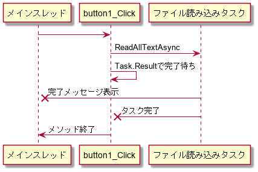

# .NETの非同期処理 第3回

by あれくま

---

# 前回のおさらい

.NET では Task を使うと比較的安全に非同期処理の待ち合わせと戻り値の取得ができました。

ただ、続きの処理を追加するにはContinueWithでコールバックを追加していかなければならず、コールバック地獄になってしまうのでした。

たとえば、指定した動画ファイルをダウンロードしてffmpegで再エンコードして指定のフォルダに移動する、という処理を非同期で行いたいとします。

``` cs
/// 指定した動画ファイルをダウンロードしてffmpegで再エンコードして指定のフォルダに移動する、という処理を非同期で行いたいとします。
Task DownloadAndEncodeAsync(Uri sourceUri, string targetFolder)
{
  //なんか非同期でファイルをダウンロードしてくれるメソッド
  //結果にダウンロードしたファイル名が入ってくる
  Task<string> downloadTask = DownloadFileAsync(sourceUri);

  //ダウンロードが終わったあとの処理を追加する
  Task<Task> withEncodeAndMoveTask = downloadTask.ContinueWith(prev => {
    //prevには前のタスク(ここではdownloadTaskと同じ)が入ってるので結果を取り出す
    string downloadedFile = prev.Result;

    //なんかffmepgを非同期で起動してでエンコードしてくれるメソッド
    Task<int> encodeTask = EncodeWithFFMPEGAsync(downloadedFile);

    //エンコードが終わったあとの処理を追加する
    //追加の処理までの結果を待てるTaskを返すよ
    Task withMoveTask = encodeTask.ContinueWith(prev2 => {
      //prev2には前のタスク(ここではencodeTaskと同じ)が入ってる
      if (prev2.Result==0) {
        //正常終了してたらtargetFolderに移動する
        File.Move(file, Path.Join(targetFolder, downloadedFile));
      }
      else {
        //失敗してたらなんか表示しよう
        Console.WriteLine($"失敗しました: {downloadedFile}");
      }
    });

    //ファイルのエンコードと移動を待つタスクを返す
    return withMoveTask;
  });

  //全部終わったら完了となるTaskを返す
  //Unwrap() を呼ぶと中のTaskが終わったら終わるTaskに変換してくれる
  return withEncodeAndMoveTask.Unwrap();
}
```

やってることは非同期でダウンロードを実行する→終わったら非同期でエンコードを実行する→終わったらファイルを移動する、とまあそんなに難しい話ではないんですが、やけに複雑なことになっています。これが待つ非同期操作が2つなのでこんなもんなんですが、非同期操作が増えれば増えるほどコールバックが増えていき混乱するコードになってしまいます。

今回はこの続きで、もっと簡単に使える機能の紹介です。

# async/await
`Task`での非同期操作をもっと手軽に使えるようにC#に追加された機能が`async`/`await`です。
これは.NETの機能ではなくC#の機能なので.NETの他の言語では使えません(似たような機能はだいたいあります)。

まず`async`についてですが、これはメソッドの宣言やラムダ式の仮引数リストの前に書きます。

``` cs
async Task DownloadAndEncodeAsync(Uri sourceUri, string targetFolder)
{
  ～
}

Func<string, string, Task> func = async (hoge, fuga) => { ～ };
```

上のように宣言の頭につけます。これを付けるとどうなるかというと……実はどうにもなりません。この`async`は、メソッドやラムダ式の中で`await`を使うことを宣言しているだけで、これが付いてるだけでは動作に変わりはありません。ラムダ式の場合は戻り値の型が`Task`や`Task<T>`に推論されるように変わりますが。
まあ中で`await`を使うなら`async`を付ける必要があるってことです。
`async`を付けた場合は`Task`や`Task<T>`などのTaskライクな型(`ValueTask`とか)か`void`しか戻り値の型に指定できなくなります。それ以外の型を指定してもコンパイルエラーになります。とはいえ中の動作に違いがあるわけではありませんね。
ちなみに`async`はメソッド(やラムダ式)の型情報に含まれません。`async Task HogeAsync()`と`Task HogeAsync()`の型は全く同じです。`async`は本当にこの中でこれから`await`を使いますよという実装上のヒントにすぎないのです。

本命は`await`です。次のようにして使います。

``` cs
async Task DownloadAndEncodeAsync(Uri sourceUri, string targetFolder)
{
  //なんか非同期でファイルをダウンロードしてくれるメソッド
  //結果にダウンロードしたファイル名が入ってくる
  string downloadedFile = await DownloadFileAsync(sourceUri);

  //なんかffmepgを非同期で起動してでエンコードしてくれるメソッド
  int encodeResult = await EncodeWithFFMPEGAsync(downloadedFile);

  if (encodeResult==0) {
    //正常終了してたらtargetFolderに移動する
    File.Move(file, Path.Join(targetFolder, downloadedFile));
  }
  else {
    //失敗してたらなんか表示しよう
    Console.WriteLine($"失敗しました: {downloadedFile}");
  }
}
```

前回のおさらいで見たコードとほぼ同じ動作をしているんですが、行数がなんと半分になっていますね。
非同期操作のためにいろいろと複雑なことをしていたのが綺麗さっぱり無くなって、非同期メソッドの呼び出し前に`await`が付いただけであとは普通のメソッド呼び出しのように見えます。

これですっきり万事解決！と言いたいところですが、実際使おうとするといろいろと悩むところが出てきます。

まずどう考えても悩ましいのは、`async`メソッドの戻り値は`void`か`Task`(および`Task<T>`)型でないといけないことです。
このメソッドを呼び出す側は`Task`を返されますので、こいつをどうにか待たないといけないんですが、`Task`を待つのに手軽なのは`await`を使うことです。`await`を使うには`async`メソッドでないといけませんね。ということは`async`メソッドを呼び出す側も`async`メソッドにして`Task`を返さないといけません。……ということを繰り返していくと`Main`まで全部`async`にしないといけないんですか!?という話になってしまいます。マジで？めんどくさくね？と思ってしまうのですが、これは本当にそうするしかありません。`async`メソッドを使うと、`Main`まで`async`メソッドになる可能性はありますし、そんなにおかしな話ではありません。

(実際には`await`以外に`Task.Result`や`Task.Wait()`で待つことも可能なのですが、場合によっては謎のデッドロックが発生するのでやめておきましょう。)

`async`メソッドの戻り値を`void`型にした場合はどうなってしまうのでしょうか？というかなんで`void`だけ許されてるんでしょうか。
まずどういう動きをするかですが、戻り値を`Task`型にしたのと同じ動作をします。ただし戻り値の`Task`は受け取れないので完了待ち(や例外発生時の処理)はできません。
つまり戻り値を`Task`型にしつつ、その戻り値を無視するのと同じになります。

次に何故`void`に指定できるかですが、これはイベントハンドラのためのものです。
イベントハンドラは通常次のような型のメソッド(やラムダ式)を指定する必要があります。

``` cs
void button1_Click(object sender, EventArgs args)
{
  ～
}
```

このイベントハンドラの中で非同期操作を待とうとしたら`async`をつけたいですが、戻り値を`Task`型にしてしまうと型が違ってイベントに登録できなくなってしまいます。
そのため戻り値に`void`だけは特別扱いで指定できるようになっています。
イベントはハンドラの完了を待ってから他の操作をしたりとか、例外の処理をしたりとか通常しないので`void`でもまあいいやってことですね。
べつにイベントハンドラでの利用に限ったものではないので他のところで`void`を指定することもできるのですが、特に互換性でどうしようもないなどの理由がなければ`Task`を返す方を使いましょう。

よし、もう完璧だな！`Task`を待つのには`await`を使おう、必要なところは全部`async`メソッドにしよう、イベントハンドラの場合は`void`を返す`async`メソッドにしよう、これだけ覚えれば問題ないですね。これにて終了です。はい解散。

# async/await の闇

ここからは大変な話をします。

## 混ぜるな危険

まずなんの変哲もない次のコードを見てください。

``` cs
async Task<string> ReadFileAsStringAsync(string filename)
{
  Debug.WriteLine($"ファイルを読み込みます: {filename}");

  var result = await File.ReadAllTextAsync(filename);
  
  Debug.WriteLine($"ファイル読み込み完了: {filename}");
  return result;
}

void Button1_Click(object sender, EventArgs e)
{
  string result = ReadFileAsStringAsync("hoge.txt").Result;
  label1.Text = result;
}
```

ボタンをクリックするとテキストファイルを読み込んでラベルに表示しようとしています。

これを実行すると……フリーズします。さようなら。
なんでフリーズするのかというとデッドロックが起きてるんですが、おそろしいことにデッドロックが起きていることがコード上からはさっぱり読み取れません。

説明はこれからやるんですが、非常に複雑になるのでとりあえず回避方法だけ説明しておきます。

``` cs
async void Button1_Click(object sender, EventArgs e)
{
  string result = await ReadFileAsStringAsync("hoge.txt");
  label1.Text = result;
}
```

`Task.Result`で完了待ちをしていたところを`await`に置き換えただけです。これが非常に重要で、GUIアプリケーションで`Task`の完了待ちをするには`Task.Result`や`Task.Wait()`などで同期待ちをやらないで`await`で待つようにしてください。

## うっかりデッドロック

なぜデッドロックが起きるのでしょうか？

まずなんの変哲もない次の非同期メソッドを見てください。

``` cs
async Task<string> ReadFileAsStringAsync(string filename)
{
  Debug.WriteLine($"ファイルを読み込みます: {filename}"); // ①

  var result = await File.ReadAllTextAsync(filename); // ②
  
  Debug.WriteLine($"ファイル読み込み完了: {filename}"); // ③
  return result;
}
```

`await`より前にある部分(①)と後にある部分(③)がありますね。②は非同期メソッドの中身を指しているつもりです。
これらは実際どのスレッドで実行されるのでしょうか？

①ですが、これは呼び出し元のスレッドで呼び出されます。`async`が付いてないメソッドと同じです。

②の中身ですが、どこでどう実行されるかはわかりません。というのも中身によるからですね。
まあここは気にしなくてよくて、どこでどう実行されるかはわからないが、`await`が終わったときには全部完了しているというのは保証されているので気にしなくてかまいません。

③は、どのスレッドで実行されるかわかりません。
呼び出し元のスレッドで実行されるかもしれませんし、全然関係ないどこかのスレッドで実行されるかもしれません。
デッドロックに関係するのはこの部分で、どのスレッドで実行されるは実は全くわからないわけではなく`SynchronizationContext.Current`というグローバル変数(というかスレッドローカル変数)で決まります。
呼び出し前に`SynchronizationContext.Current`が何に設定されていたかで、どのスレッドで実行されるかが決まるのです。

`SynchronizationContext`というのは何をするクラスかというと、別スレッドからあるスレッドに処理をぶん投げるのに使われます。
たとえばGUIアプリケーションだとたいていメインスレッドからしかコントロールにアクセスできません。
そのため別スレッドからコントロールにアクセスする処理を実行したい場合は、Windows.Formsだと`Control.BeginInvoke()`、WPFだと`Dispatcher.BeginInvoke()`を使ってコントロールのあるスレッド上で渡した処理を実行させます。
これを抽象化したのが`SynchronizationContext`で、`SynchronizationContext.Post()`に処理を渡すと、Windows.FormsだろうがWPFだろうがいい感じにメインスレッドで処理を実行してくれます。

ちなみにGUIアプリケーション以外のコンソールアプリやASP.NET Coreのアプリでは`SynchronizationContext.Current`は`null`になっており、デフォルトのものが使われます。
デフォルトではスレッドプール上で処理を実行するので、メインスレッド以外のどこかのスレッドで実行されることになります。

それを踏まえてもう一度デッドロックするコードを見てみましょう

``` cs
void Button1_Click(object sender, EventArgs e)
{
  string result = ReadFileAsStringAsync("hoge.txt").Result; // メインスレッド
  label1.Text = result; // メインスレッド
}

async Task<string> ReadFileAsStringAsync(string filename)
{
  Debug.WriteLine($"ファイルを読み込みます: {filename}"); // ① // メインスレッド

  var result = await File.ReadAllTextAsync(filename); // ② // どこかのスレッド
  
  Debug.WriteLine($"ファイル読み込み完了: {filename}"); // ③ // メインスレッド
  return result;
}
```

今回はGUIアプリケーションを想定してますので、`await`の後(③)も`SynchronizationContext`の働きによりメインスレッドで実行されます。
さて、これだけではまだデッドロックは見えてきませんね……。
ところで`await`と同等のコードはどうなっているんでしたっけ？というところを見ていきましょう。

``` cs
void Button1_Click(object sender, EventArgs e)
{
  string result = ReadFileAsStringAsync("hoge.txt").Result;
  label1.Text = result;
}

Task<string> ReadFileAsStringAsync(string filename)
{
  Debug.WriteLine($"ファイルを読み込みます: {filename}");

  Task<string> resultTask = File.ReadAllTextAsync(filename).ContinueWith(prev => {
    string result = prev.result;

    Debug.WriteLine($"ファイル読み込み完了: {filename}");
    return prev.result;
  });

  return resultTask;
}
```

`ContinueWith()`で後の処理をつなげたのと同じような動作をするのでした。ただこれだけだと`SynchronizationContext`の処理が足りてないので実際はもうちょっと複雑になります。

``` cs
void Button1_Click(object sender, EventArgs e)
{
  string result = ReadFileAsStringAsync("hoge.txt").Result;
  label1.Text = result;
}

Task<string> ReadFileAsStringAsync(string filename)
{
  var syncContext = SynchronizationContext.Current; //ここで呼び出された時点のSynchronizationContextを取得しておく

  Debug.WriteLine($"ファイルを読み込みます: {filename}");

  Task<Task<string>> resultTask = File.ReadAllTextAsync(filename).ContinueWith(prev => {
    TaskCompletionSource tcs = new TaskCompletionSource();
    syncContext.Post(state => { //Form.BeginInvoke()とだいたい同じ
      string result = prev.result;

      Debug.WriteLine.Write($"ファイル読み込み完了: {filename}");
      tcs.SetResult(result);
    }, null);
    return tsc.Task;
  });

  return resultTask.Unwrap();
}
```

複雑になりましたが、③の処理が`Form.BeginInvoke()`したのと同じように実行されるのがわかれば充分です。ちょっと整理してみましょう。


``` cs
void button1_Click(object sender, EventArgs e)
{
  Debug.WriteLine("ファイルを読み込みます: hoge.txt");

  Task<string> resultTask = File.ReadAllTextAsync(filename).ContinueWith(prev => {
    TaskCompletionSource tcs = new TaskCompletionSource();

    this.BeginInvoke(() => {
      string result = prev.result;

      Debug.WriteLine("ファイル読み込み完了: hoge.txt"); // α
      tcs.SetResult(result);
    });
    return tsc.Task;
  }).Unwrap();

  resultTask.Wait(); // β
  string result = resultTask.Result;
  label1.Text = result;
}
```

これでデッドロックの例とほぼ同じ動きになります。
`resultTask` は「ファイル読み込み完了」のデバッグメッセージ表示(α)をメインスレッドで実行して完了となるタスクです。
一方βの行はどのスレッドで実行されるでしょうか。もちろんメインスレッドですね。メインスレッドでタスクの完了を同期待ちします。

気になるのは、「「デバッグメッセージ表示(α)をメインスレッドで実行して完了となるタスク」をメインスレッドで同期で待っている(β)」ことです。
`Form.BeginInvoke()`で指定した処理(α)はいつ実行されるのでしょうか？これはイベントハンドラの処理が行なわれていない時、つまり`button1_Click`が終わってからです。
しかしβはαが終わるのを待っており`button1_Click`は当然βが終わらないと終わりません。`button1_Click`が終わるには`α`が終わらないといけないのですが、`α`が終わるには`button1_Click`が終わらないといけません。おおっと、デッドロック。

順を追って見てみますと……

1. メインスレッドが`button1_Click`を呼び出す。
2. 「ファイルを読み込みます」のデバッグメッセージを表示する。
3. ファイルの読み込みの処理を非同期で開始する。
4. ファイル読み込みの非同期処理にメインスレッドで「ファイル読み込み完了」のデバッグメッセージを表示する処理(α)を追加する。
5. ファイル読み込みとメインスレッドで「ファイル読み込み完了」のデバッグメッセージを表示する処理(α)が終わるのを待ちます。
6. いつかファイル読み込みが完了します。
7. ファイル読み込み処理に追加された、メインスレッドで「ファイル読み込み完了」のデバッグメッセージを表示する処理(α)が実行されようとしますが、メインスレッドでは`button1_Click()`が実行中なので終わるまで待ちます。
8. メインスレッドの`button1_Click`ではαが終わるのを待っています。
9. 互いに待ちあってデッドロック！



<!--
@startuml
メインスレッド -> button1_Click
button1_Click -> ファイル読み込みタスク : ReadAllTextAsync
button1_Click -> button1_Click : Task.Resultで完了待ち
ファイル読み込みタスク ->x メインスレッド : 完了メッセージ表示
ファイル読み込みタスク ->x button1_Click : タスク完了
button1_Click -> メインスレッド : メソッド終了
@enduml
-->


GUIアプリケーションで`Task`の同期待ちをしてしまうと、このように簡単にデッドロックに陥ってしまいます。書くのは簡単なのに原因はコードからわかりづらいのが最悪ですね。

回避策としては`Task`は全部`await`で待てばいいんですが、どうしてそうなるのか見てみましょう。

``` cs
async void button1_Click(object sender, EventArgs e)
{
  string result = await ReadFileAsStringAsync("hoge.txt");
  label1.Text = result;
}

Task<string> ReadFileAsStringAsync(string filename)
{
  Debug.WriteLine($"ファイルを読み込みます: {filename}");

  var result = await File.ReadAllTextAsync(filename);

  Debug.WriteLine.Write($"ファイル読み込み完了: {filename}");
  return result;
}
```

これが回避した版です。`button1_Click()`では`ReadFileAsStringAsync().Result`でなく`await ReadFileAsStringAsync()`で待つようにしただけです。これを同等のコードに展開してみるとどうなるでしょうか。

``` cs
void button1_Click(object sender, EventArgs e)
{
  Debug.WriteLine("ファイルを読み込みます: hoge.txt");

  Task<string> resultTask = File.ReadAllTextAsync(filename).ContinueWith(prev => {
    TaskCompletionSource tcs = new TaskCompletionSource();

    this.BeginInvoke(() => {
      string result = prev.result;

      Debug.WriteLine.Write("ファイル読み込み完了: hoge.txt"); // α
      tcs.SetResult(result);
    });
    return tsc.Task;
  }).Unwrap();

  resultTask.ContinueWith(prev => { // β
    this.BeginInvoke(() => {
      label1.Text = result; // γ
    });
  });

  // δ
}
```

βとして以前は待っていたところが`ContinueWith()`に置き換わりました。`ContinueWith()`は前の`Task`が終わったら実行してくれる処理を追加するメソッドです。`ContinueWith()`自体は待ったりせずに処理を登録したらすぐに返ってくることに気をつけてください。つまりβは一瞬で終わります。

この処理の流れは次のようになります。

1. 「ファイルを読み込みます」のデバッグメッセージを表示する。
2. ファイルの読み込みの処理を非同期で開始する。
3. ファイル読み込みの非同期処理にメインスレッドで「ファイル読み込み完了」のデバッグメッセージを表示する処理(α)を追加する。
4. ファイル読み込みとメインスレッドで「ファイル読み込み完了」のデバッグメッセージを表示する処理(α)が終わったら、メインスレッドで結果をラベルに表示する処理(γ)を追加する(β)。
5. 非同期処理の終了待ちはしないので`button1_Click`が終了する(δ)。メインスレッドが空く。
6. 非同期処理は続くのでいつかファイル読み込みが完了する。
7. ファイル読み込み処理に追加された、メインスレッドで「ファイル読み込み完了」のデバッグメッセージを表示する処理(α)が実行される。αがすぐ終わるのでメインスレッドが空く。
4. ファイル読み込みとメインスレッドで「ファイル読み込み完了」のデバッグメッセージを表示する処理(α)に追加された、メインスレッドで結果をラベルに表示する処理(γ)が実行される。γもすぐ終わるのでメインスレッドが空く。

今度は`button1_Click`が非同期処理の完了を待たずして終わるためメインスレッドがすぐ空き、次のメインスレッドで何かする処理が実行できます。そしてそれらもすぐ終わるため、いつもメインスレッドはすぐに他の処理を実行することができます。

## GUI以外はでデッドロックしない？
GUIアプリでは `await` と `Task.Result` や `Task.Wait()` を混ぜて使うと簡単にデッドロックしてしまうのがわかりました。
では、GUIアプリ以外ではどうなるのでしょうか？

GUIアプリ以外ではわざわざ`SynchronizationContext.Current`を設定しない限りはこの値は`null`になっていてデフォルトの`SynchronizationContext`が使われます。
デフォルトの`SynchronizationContext`は`SynchronizationContext.Post()`で渡された処理をスレッドプールで実行します。
メインスレッドを待たずにどこかのスレッドで勝手に実行するのでデッドロックはそう簡単に起きません。よかったね。

逆に言うと`await`の前後で実行されるスレッドが変わる可能性がある(高い)ことに気をつけてください。

```
async Task<string> ReadFileAsStringAsync(string filename)
{
  Debug.WriteLine($"ファイルを読み込みます: {filename}"); // ① // メイン(呼び出し元の)スレッド

  var result = await File.ReadAllTextAsync(filename); // ② // どこかのスレッド
  
  Debug.WriteLine($"ファイル読み込み完了: {filename}"); // ③ // GUIアプリ以外ではどこかのスレッド
  return result;
}
```

こうなります。GUIアプリではメインスレッドで実行されていた③が、どこかのスレッドで実行されます。
ここに呼び出し元と同じスレッドで実行されることを期待するようなコードを書いてしまうと、デッドロックやデータの一貫性が失なわれるなどおかしなことになる可能性があることに気をつけましょう。

## 呼び出し元を気にせず`await`したい

`await`の後のスレッドがメインスレッドで実行されるかどうかわからない件ですが、`Task.ConfigureAwait(false)`を呼び出すことで回避することができます。
これを呼び出すと`SynchronizationContext`を使わなくなるので、呼び出し元がGUIアプリケーションかどうかにかかわらず常にどこかのスレッドで実行されます。

```
async Task<string> ReadFileAsStringAsync(string filename)
{
  Debug.WriteLine($"ファイルを読み込みます: {filename}"); // ① // メイン(呼び出し元の)スレッド

  var result = await File.ReadAllTextAsync(filename).ConfigureAwait(false); // ② // どこかのスレッド
  
  Debug.WriteLine($"ファイル読み込み完了: {filename}"); // ③ // どこかのスレッド(②と同じことが多い)
  return result;
}
```

どういう時に使うかというと、`await`の後がどこで実行されてもかまわないという時に使うと、わざわざ`SynchronizationContext`に処理を投げなくなるので微妙に速くなります。
まあアプリケーションではあまり気にすることもないので普通には使わなくて良いでしょう。
使われているところがあった時に見てわかればいいかなという程度で。

# おわり
今回は `async/await` の使い方と、気をつけないとなぜかデッドロックが起きる話をしました。
だいたいこれが分かってればC#の `async/await` は怖くないはずです。

とりあえず非同期処理の紹介としてはこのくらいで終わらせておきます。

本当は `async stream` なんかも紹介できればよかったんですが、かなり複雑な話なのと、もう3回もやって飽きてきたので一旦切り上げます。
たぶんもっとわかりやすい詳しい話はどこか探せばきっとあるのでまあいいよね。


